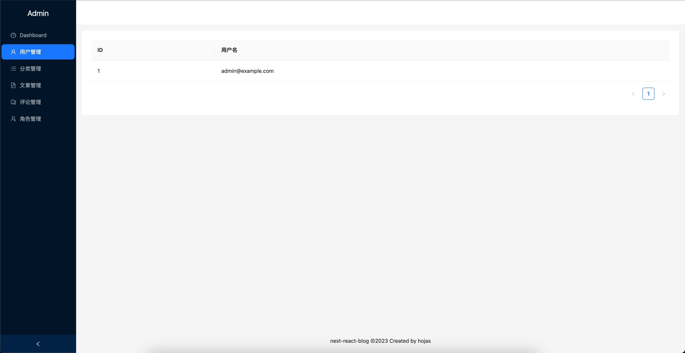
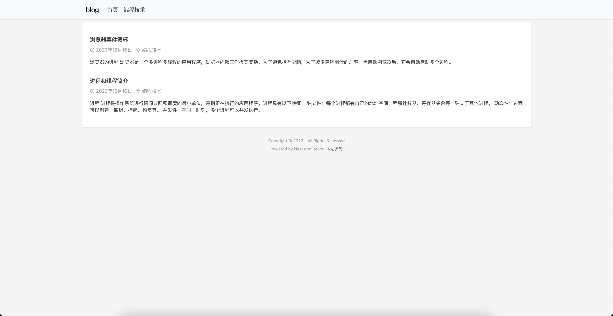

# nest-react-blog

A simple blog system built with Nest, React and Nx.

## Screenshots

### Admin



### Web



## Tech Stack

1. Nx
2. Nest
3. Postgresql
4. Prisma
5. React
6. Next
7. Bootstrap
8. Ant Design
9. Tailwind CSS
10. Vite
11. Docker

## Features

1. User management
2. Role management
3. Topic management
4. Article management
5. Comment management

## Run with docker-compose

### 1. Create .env.production file

```env
DATABASE_URL="postgresql://nest_blog:nest_blog@db:5432/nest_blog?schema=public&connect_timeout=300"
JWT_SECRET=your_jwt_secret_key
JWT_EXPIRES=86400s
SHA_SECRET=your_sha_secret_key
API_PORT=8081
VITE_API_BASE_URL=http://localhost:4200/api
WEB_API_BASE_URL=http://localhost:8080/api
```

### 2. Run [nginx-proxy](https://github.com/hojas/nginx-proxy) first

### 3. Run with docker-compose in production mode

Set your Domain in docker-compose.yaml if you need.

```yml

```shell
$ docker-compose up -d
```

## Development

Install:

```shell
$ pnpm install
$ pnpm run prisma:generate
$ pnpm run prisma:migrate
```

Run server:

```shell
$ pnpm nx serve server
```

Run admin:

```shell
$ pnpm nx serve admin
```

Run web:

```shell
$ pnpm nx serve web
```
